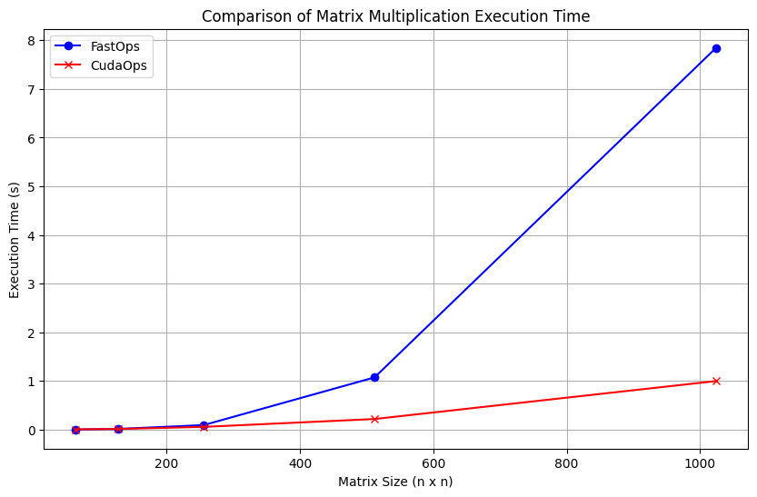

# MiniTorch Module 3


* Docs: https://minitorch.github.io/

* Overview: https://minitorch.github.io/module3.html


You will need to modify `tensor_functions.py` slightly in this assignment.

* Tests:

```
python run_tests.py
```

* Note:

Several of the tests for this assignment will only run if you are on a GPU machine and will not
run on github's test infrastructure. Please follow the instructions to setup up a colab machine
to run these tests.

This assignment requires the following files from the previous assignments. You can get these by running

```bash
python sync_previous_module.py previous-module-dir current-module-dir
```

The files that will be synced are:

        minitorch/tensor_data.py minitorch/tensor_functions.py minitorch/tensor_ops.py minitorch/operators.py minitorch/scalar.py minitorch/scalar_functions.py minitorch/module.py minitorch/autodiff.py minitorch/module.py project/run_manual.py project/run_scalar.py project/run_tensor.py minitorch/operators.py minitorch/module.py minitorch/autodiff.py minitorch/tensor.py minitorch/datasets.py minitorch/testing.py minitorch/optim.py


# Task 1 & 2
```bash
   python3 project/parallel_check.py
   ```

   ```bash
MAP

================================================================================
 Parallel Accelerator Optimizing:  Function tensor_map.<locals>._map,
/users/rundong/github/mod3-rd1119/minitorch/fast_ops.py (175)
================================================================================


Parallel loop listing for  Function tensor_map.<locals>._map, /users/rundong/github/mod3-rd1119/minitorch/fast_ops.py (175)
-----------------------------------------------------------------------------|loop #ID
    def _map(                                                                |
        out: Storage,                                                        |
        out_shape: Shape,                                                    |
        out_strides: Strides,                                                |
        in_storage: Storage,                                                 |
        in_shape: Shape,                                                     |
        in_strides: Strides,                                                 |
    ) -> None:                                                               |
        # TODO: Implement for Task 3.1.                                      |
        out_size = len(out)                                                  |
        if np.array_equal(out_strides, in_strides) and np.array_equal(       |
            out_shape, in_shape                                              |
        ):                                                                   |
            for ordinal in prange(out_size):---------------------------------| #2
                out[ordinal] = fn(in_storage[ordinal])                       |
        else:                                                                |
            for ordinal in prange(out_size):---------------------------------| #3
                in_index: Index = np.zeros(MAX_DIMS, dtype=np.int32)---------| #0
                out_index: Index = np.zeros(MAX_DIMS, dtype=np.int32)--------| #1
                to_index(ordinal, out_shape, out_index)                      |
                broadcast_index(out_index, out_shape, in_shape, in_index)    |
                position = index_to_position(in_index, in_strides)           |
                out_position = index_to_position(out_index, out_strides)     |
                out[out_position] = fn(float(in_storage[position]))          |
--------------------------------- Fusing loops ---------------------------------
Attempting fusion of parallel loops (combines loops with similar properties)...

Fused loop summary:
+--0 has the following loops fused into it:
   +--1 (fused)
Following the attempted fusion of parallel for-loops there are 3 parallel for-
loop(s) (originating from loops labelled: #2, #3, #0).
--------------------------------------------------------------------------------
---------------------------- Optimising loop nests -----------------------------
Attempting loop nest rewrites (optimising for the largest parallel loops)...

+--3 is a parallel loop
   +--0 --> rewritten as a serial loop
--------------------------------------------------------------------------------
----------------------------- Before Optimisation ------------------------------
Parallel region 0:
+--3 (parallel)
   +--0 (parallel)
   +--1 (parallel)


--------------------------------------------------------------------------------
------------------------------ After Optimisation ------------------------------
Parallel region 0:
+--3 (parallel)
   +--0 (serial, fused with loop(s): 1)


Parallel region 0 (loop #3) had 1 loop(s) fused and 1 loop(s) serialized as part
 of the larger parallel loop (#3).
--------------------------------------------------------------------------------
--------------------------------------------------------------------------------

---------------------------Loop invariant code motion---------------------------
Allocation hoisting:
The memory allocation derived from the instruction at
/users/rundong/github/mod3-rd1119/minitorch/fast_ops.py (192) is hoisted out of
the parallel loop labelled #3 (it will be performed before the loop is executed
and reused inside the loop):
   Allocation:: in_index: Index = np.zeros(MAX_DIMS, dtype=np.int32)
    - numpy.empty() is used for the allocation.
The memory allocation derived from the instruction at
/users/rundong/github/mod3-rd1119/minitorch/fast_ops.py (193) is hoisted out of
the parallel loop labelled #3 (it will be performed before the loop is executed
and reused inside the loop):
   Allocation:: out_index: Index = np.zeros(MAX_DIMS, dtype=np.int32)
    - numpy.empty() is used for the allocation.
None
ZIP

================================================================================
 Parallel Accelerator Optimizing:  Function tensor_zip.<locals>._zip,
/users/rundong/github/mod3-rd1119/minitorch/fast_ops.py (226)
================================================================================


Parallel loop listing for  Function tensor_zip.<locals>._zip, /users/rundong/github/mod3-rd1119/minitorch/fast_ops.py (226)
-----------------------------------------------------------------------------|loop #ID
    def _zip(                                                                |
        out: Storage,                                                        |
        out_shape: Shape,                                                    |
        out_strides: Strides,                                                |
        a_storage: Storage,                                                  |
        a_shape: Shape,                                                      |
        a_strides: Strides,                                                  |
        b_storage: Storage,                                                  |
        b_shape: Shape,                                                      |
        b_strides: Strides,                                                  |
    ) -> None:                                                               |
        # TODO: Implement for Task 3.1.                                      |
        out_size = len(out)                                                  |
        if (                                                                 |
            np.array_equal(out_strides, a_strides)                           |
            and np.array_equal(out_strides, b_strides)                       |
            and np.array_equal(out_shape, a_shape)                           |
            and np.array_equal(out_shape, b_shape)                           |
        ):                                                                   |
            for i in prange(out_size):---------------------------------------| #4
                out[i] = fn(a_storage[i], b_storage[i])                      |
        else:                                                                |
            for ordinal in prange(out_size):---------------------------------| #5
                out_index: Index = np.empty(MAX_DIMS, dtype=np.int32)        |
                a_index: Index = np.empty(MAX_DIMS, dtype=np.int32)          |
                b_index: Index = np.empty(MAX_DIMS, dtype=np.int32)          |
                to_index(ordinal, out_shape, out_index)                      |
                broadcast_index(out_index, out_shape, a_shape, a_index)      |
                a_data = a_storage[index_to_position(a_index, a_strides)]    |
                broadcast_index(out_index, out_shape, b_shape, b_index)      |
                b_data = b_storage[index_to_position(b_index, b_strides)]    |
                out[index_to_position(out_index, out_strides)] = fn(         |
                    float(a_data), float(b_data)                             |
                )                                                            |
--------------------------------- Fusing loops ---------------------------------
Attempting fusion of parallel loops (combines loops with similar properties)...
Following the attempted fusion of parallel for-loops there are 2 parallel for-
loop(s) (originating from loops labelled: #4, #5).
--------------------------------------------------------------------------------
----------------------------- Before Optimisation ------------------------------
--------------------------------------------------------------------------------
------------------------------ After Optimisation ------------------------------
Parallel structure is already optimal.
--------------------------------------------------------------------------------
--------------------------------------------------------------------------------

---------------------------Loop invariant code motion---------------------------
Allocation hoisting:
The memory allocation derived from the instruction at
/users/rundong/github/mod3-rd1119/minitorch/fast_ops.py (249) is hoisted out of
the parallel loop labelled #5 (it will be performed before the loop is executed
and reused inside the loop):
   Allocation:: out_index: Index = np.empty(MAX_DIMS, dtype=np.int32)
    - numpy.empty() is used for the allocation.
The memory allocation derived from the instruction at
/users/rundong/github/mod3-rd1119/minitorch/fast_ops.py (250) is hoisted out of
the parallel loop labelled #5 (it will be performed before the loop is executed
and reused inside the loop):
   Allocation:: a_index: Index = np.empty(MAX_DIMS, dtype=np.int32)
    - numpy.empty() is used for the allocation.
The memory allocation derived from the instruction at
/users/rundong/github/mod3-rd1119/minitorch/fast_ops.py (251) is hoisted out of
the parallel loop labelled #5 (it will be performed before the loop is executed
and reused inside the loop):
   Allocation:: b_index: Index = np.empty(MAX_DIMS, dtype=np.int32)
    - numpy.empty() is used for the allocation.
None
REDUCE

================================================================================
 Parallel Accelerator Optimizing:  Function tensor_reduce.<locals>._reduce,
/users/rundong/github/mod3-rd1119/minitorch/fast_ops.py (285)
================================================================================


Parallel loop listing for  Function tensor_reduce.<locals>._reduce, /users/rundong/github/mod3-rd1119/minitorch/fast_ops.py (285)
--------------------------------------------------------------------------------|loop #ID
    def _reduce(                                                                |
        out: Storage,                                                           |
        out_shape: Shape,                                                       |
        out_strides: Strides,                                                   |
        a_storage: Storage,                                                     |
        a_shape: Shape,                                                         |
        a_strides: Strides,                                                     |
        reduce_dim: int,                                                        |
    ) -> None:                                                                  |
        # TODO: Implement for Task 3.1.                                         |
                                                                                |
        out_size: int = len(out)                                                |
        reduce_size: int = a_shape[reduce_dim]                                  |
        for ordinal in prange(out_size):----------------------------------------| #7
            out_index: Index = np.zeros(MAX_DIMS, dtype=np.int32)---------------| #6
            to_index(ordinal, out_shape, out_index)                             |
            a_ordinal = index_to_position(out_index, a_strides)                 |
            reduced_val = out[ordinal]                                          |
            for j in range(reduce_size):                                        |
                reduced_val = fn(                                               |
                    reduced_val,                                                |
                    float(a_storage[a_ordinal + j * a_strides[reduce_dim]]),    |
                )                                                               |
            out[ordinal] = reduced_val                                          |
--------------------------------- Fusing loops ---------------------------------
Attempting fusion of parallel loops (combines loops with similar properties)...
Following the attempted fusion of parallel for-loops there are 2 parallel for-
loop(s) (originating from loops labelled: #7, #6).
--------------------------------------------------------------------------------
---------------------------- Optimising loop nests -----------------------------
Attempting loop nest rewrites (optimising for the largest parallel loops)...

+--7 is a parallel loop
   +--6 --> rewritten as a serial loop
--------------------------------------------------------------------------------
----------------------------- Before Optimisation ------------------------------
Parallel region 0:
+--7 (parallel)
   +--6 (parallel)


--------------------------------------------------------------------------------
------------------------------ After Optimisation ------------------------------
Parallel region 0:
+--7 (parallel)
   +--6 (serial)


Parallel region 0 (loop #7) had 0 loop(s) fused and 1 loop(s) serialized as part
 of the larger parallel loop (#7).
--------------------------------------------------------------------------------
--------------------------------------------------------------------------------

---------------------------Loop invariant code motion---------------------------
Allocation hoisting:
The memory allocation derived from the instruction at
/users/rundong/github/mod3-rd1119/minitorch/fast_ops.py (299) is hoisted out of
the parallel loop labelled #7 (it will be performed before the loop is executed
and reused inside the loop):
   Allocation:: out_index: Index = np.zeros(MAX_DIMS, dtype=np.int32)
    - numpy.empty() is used for the allocation.
None
MATRIX MULTIPLY

================================================================================
 Parallel Accelerator Optimizing:  Function _tensor_matrix_multiply,
/users/rundong/github/mod3-rd1119/minitorch/fast_ops.py (313)
================================================================================


Parallel loop listing for  Function _tensor_matrix_multiply, /users/rundong/github/mod3-rd1119/minitorch/fast_ops.py (313)
--------------------------------------------------------------------------------------------|loop #ID
def _tensor_matrix_multiply(                                                                |
    out: Storage,                                                                           |
    out_shape: Shape,                                                                       |
    out_strides: Strides,                                                                   |
    a_storage: Storage,                                                                     |
    a_shape: Shape,                                                                         |
    a_strides: Strides,                                                                     |
    b_storage: Storage,                                                                     |
    b_shape: Shape,                                                                         |
    b_strides: Strides,                                                                     |
) -> None:                                                                                  |
    """NUMBA tensor matrix multiply function.                                               |
                                                                                            |
    Should work for any tensor shapes that broadcast as long as                             |
                                                                                            |
    ```                                                                                     |
    assert a_shape[-1] == b_shape[-2]                                                       |
    ```                                                                                     |
                                                                                            |
    Optimizations:                                                                          |
                                                                                            |
    * Outer loop in parallel                                                                |
    * No index buffers or function calls                                                    |
    * Inner loop should have no global writes, 1 multiply.                                  |
                                                                                            |
                                                                                            |
    Args:                                                                                   |
    ----                                                                                    |
        out (Storage): storage for `out` tensor                                             |
        out_shape (Shape): shape for `out` tensor                                           |
        out_strides (Strides): strides for `out` tensor                                     |
        a_storage (Storage): storage for `a` tensor                                         |
        a_shape (Shape): shape for `a` tensor                                               |
        a_strides (Strides): strides for `a` tensor                                         |
        b_storage (Storage): storage for `b` tensor                                         |
        b_shape (Shape): shape for `b` tensor                                               |
        b_strides (Strides): strides for `b` tensor                                         |
                                                                                            |
    Returns:                                                                                |
    -------                                                                                 |
        None : Fills in `out`                                                               |
                                                                                            |
    """                                                                                     |
    a_batch_stride = a_strides[0] if a_shape[0] > 1 else 0                                  |
    b_batch_stride = b_strides[0] if b_shape[0] > 1 else 0                                  |
                                                                                            |
    # TODO: Implement for Task 3.2.                                                         |
    N = a_shape[-1]                                                                         |
    I, J, K = out_shape[-3:]                                                                |
    for i in prange(I):---------------------------------------------------------------------| #10
        for j in prange(J):-----------------------------------------------------------------| #9
            for k in prange(K):-------------------------------------------------------------| #8
                sum_val = 0.0                                                               |
                a_ordinal = i * a_batch_stride + j * a_strides[-2]                          |
                b_ordinal = i * b_batch_stride + k * b_strides[-1]                          |
                for _ in range(N):                                                          |
                    sum_val += a_storage[a_ordinal] * b_storage[b_ordinal]  # 1 multiply    |
                    a_ordinal += a_strides[-1]                                              |
                    b_ordinal += b_strides[-2]                                              |
                out_ordinal = (                                                             |
                    i * out_strides[-3] + j * out_strides[-2] + k * out_strides[-1]         |
                )                                                                           |
                out[out_ordinal] = sum_val                                                  |
--------------------------------- Fusing loops ---------------------------------
Attempting fusion of parallel loops (combines loops with similar properties)...
Following the attempted fusion of parallel for-loops there are 2 parallel for-
loop(s) (originating from loops labelled: #10, #9).
--------------------------------------------------------------------------------
---------------------------- Optimising loop nests -----------------------------
Attempting loop nest rewrites (optimising for the largest parallel loops)...

+--10 is a parallel loop
   +--9 --> rewritten as a serial loop
      +--8 --> rewritten as a serial loop
--------------------------------------------------------------------------------
----------------------------- Before Optimisation ------------------------------
Parallel region 0:
+--10 (parallel)
   +--9 (parallel)
      +--8 (parallel)


--------------------------------------------------------------------------------
------------------------------ After Optimisation ------------------------------
Parallel region 0:
+--10 (parallel)
   +--9 (serial)
      +--8 (serial)


Parallel region 0 (loop #10) had 0 loop(s) fused and 2 loop(s) serialized as
part of the larger parallel loop (#10).
--------------------------------------------------------------------------------
--------------------------------------------------------------------------------

---------------------------Loop invariant code motion---------------------------
Allocation hoisting:
No allocation hoisting found
None
```
# Task 4

| Size| FastOps Time (s) | CudaOps Time (s) |
|----------------------|------------------|------------------|
| 64                   | 0.02312         | 0.02335         |
| 128                  | 0.05791         | 0.04449         |
| 256                  | 0.30489         | 0.18598         |
| 512                  | 1.12996         | 0.22937         |
| 1024                 | 9.40424         | 1.03345         |
The graph for the comparation between Cuda Implementation and naive operations.


# Task5

## GPU, Hidden=100, Dataset=Split, Rate=0.05
   ```bash
   !cd $DIR; PYTHONPATH=/content/$DIR python3.12 project/run_fast_tensor.py --BACKEND gpu --HIDDEN 100 --DATASET split --RATE 0.05
   ```

   ```bash
        Epoch  0  loss  7.688148222933304 correct 30 Time per epoch 0.3406862258911133
        Epoch  10  loss  6.1680151037968205 correct 35 Time per epoch 1.6692253589630126
        Epoch  20  loss  4.7741392840752965 correct 37 Time per epoch 1.762924313545227
        Epoch  30  loss  4.346382903389426 correct 40 Time per epoch 1.6808827877044679
        Epoch  40  loss  4.308503028779119 correct 44 Time per epoch 1.719099497795105
        Epoch  50  loss  4.197957964156718 correct 42 Time per epoch 1.7342091798782349
        Epoch  60  loss  2.9995077168207036 correct 45 Time per epoch 1.6808377504348755
        Epoch  70  loss  3.4779208657886667 correct 46 Time per epoch 1.7483661651611329
        Epoch  80  loss  3.9497797183263703 correct 48 Time per epoch 1.6790812253952025
        Epoch  90  loss  3.9307794378358123 correct 46 Time per epoch 1.6695638656616212
        Epoch  100  loss  2.3408501507309514 correct 49 Time per epoch 1.824935245513916
        Epoch  110  loss  2.0587853155329743 correct 48 Time per epoch 1.6709300994873046
        Epoch  120  loss  4.132695305593517 correct 46 Time per epoch 1.7615332841873168
        Epoch  130  loss  3.454619310193144 correct 50 Time per epoch 1.674421501159668
        Epoch  140  loss  1.8311892886856576 correct 48 Time per epoch 1.6600759744644165
        Epoch  150  loss  1.0560337043392742 correct 49 Time per epoch 1.7388724327087401
        Epoch  160  loss  1.980566183854537 correct 48 Time per epoch 1.667748475074768
        Epoch  170  loss  1.7985442649207157 correct 49 Time per epoch 1.7507199764251709
        Epoch  180  loss  0.5399352055832123 correct 47 Time per epoch 1.6556903839111328
        Epoch  190  loss  1.6947419634122007 correct 50 Time per epoch 1.6585009574890137
        Epoch  200  loss  0.9725340137803034 correct 48 Time per epoch 1.7355946063995362
        Epoch  210  loss  1.2648026105825658 correct 47 Time per epoch 1.6688340902328491
        Epoch  220  loss  0.6692184937686563 correct 48 Time per epoch 1.6789358139038086
        Epoch  230  loss  0.48010416029548736 correct 49 Time per epoch 1.724643301963806
        Epoch  240  loss  1.080381112160227 correct 49 Time per epoch 1.6610349655151366
        Epoch  250  loss  0.4393718342869569 correct 47 Time per epoch 1.7338584423065186
        Epoch  260  loss  1.1302600183773832 correct 50 Time per epoch 1.6751198053359986
        Epoch  270  loss  1.2608600825610796 correct 50 Time per epoch 1.7502344131469727
        Epoch  280  loss  1.4453276193213649 correct 49 Time per epoch 1.7316830635070801
        Epoch  290  loss  0.952912317426057 correct 49 Time per epoch 1.6306398153305053
        Epoch  300  loss  0.7348444740058877 correct 50 Time per epoch 1.7147754192352296
        Epoch  310  loss  0.9970982565364992 correct 50 Time per epoch 1.7062728643417358
        Epoch  320  loss  1.1312808032704507 correct 50 Time per epoch 1.6513673543930054
        Epoch  330  loss  0.9106938125691048 correct 49 Time per epoch 1.7412392854690553
        Epoch  340  loss  0.2432130729158703 correct 49 Time per epoch 1.6508301019668579
        Epoch  350  loss  1.4321382612744478 correct 48 Time per epoch 1.6689801692962647
        Epoch  360  loss  1.2770993632872834 correct 48 Time per epoch 1.7349042415618896
        Epoch  370  loss  0.3905935357692314 correct 49 Time per epoch 1.6653281211853028
        Epoch  380  loss  0.10067609630348295 correct 50 Time per epoch 1.7467737674713135
        Epoch  390  loss  0.5296563485765328 correct 49 Time per epoch 1.664874053001404
        Epoch  400  loss  0.10217826939219532 correct 48 Time per epoch 1.6567391157150269
        Epoch  410  loss  1.5051979274325107 correct 49 Time per epoch 1.7463252544403076
        Epoch  420  loss  0.6155442472982214 correct 49 Time per epoch 1.670920157432556
        Epoch  430  loss  0.14839779512578766 correct 49 Time per epoch 1.712520694732666
        Epoch  440  loss  0.45083244030075137 correct 50 Time per epoch 1.7555158853530883
        Epoch  450  loss  0.6071345827957436 correct 48 Time per epoch 1.6565726280212403
        Epoch  460  loss  0.4478856085316886 correct 49 Time per epoch 1.7316564559936523
        Epoch  470  loss  1.1203439569826616 correct 45 Time per epoch 1.659480905532837
        Epoch  480  loss  0.17388449337319056 correct 49 Time per epoch 1.69452645778656
        Epoch  490  loss  0.8848135997497504 correct 50 Time per epoch 1.7197197437286378
```
## Log for CPU, Hidden=100, Dataset=Split, Rate=0.05
```bash
   !cd $DIR; PYTHONPATH=/content/$DIR python3.12 project/run_fast_tensor.py --BACKEND cpu --HIDDEN 100 --DATASET split --RATE 0.05
   ```

   ```bash
        Epoch  0  loss  8.760159055029817 correct 22 Time per epoch 1.537349271774292
        Epoch  10  loss  6.241649899491496 correct 36 Time per epoch 0.18757109642028807
        Epoch  20  loss  5.548609635617908 correct 42 Time per epoch 0.11908247470855712
        Epoch  30  loss  6.880766694680443 correct 45 Time per epoch 0.11998693943023682
        Epoch  40  loss  4.506264573864563 correct 46 Time per epoch 0.11753599643707276
        Epoch  50  loss  3.712752086351173 correct 48 Time per epoch 0.11840150356292725
        Epoch  60  loss  2.373912691896443 correct 48 Time per epoch 0.1181708574295044
        Epoch  70  loss  3.2657258889205116 correct 46 Time per epoch 0.11861536502838135
        Epoch  80  loss  2.8084246521120333 correct 47 Time per epoch 0.12122879028320313
        Epoch  90  loss  2.384135625036369 correct 46 Time per epoch 0.11840715408325195
        Epoch  100  loss  1.8495565326822088 correct 50 Time per epoch 0.188248610496521
        Epoch  110  loss  2.3942707454495604 correct 47 Time per epoch 0.1566373348236084
        Epoch  120  loss  1.0981690192055171 correct 47 Time per epoch 0.118084716796875
        Epoch  130  loss  1.4690774441386465 correct 49 Time per epoch 0.11915571689605713
        Epoch  140  loss  1.8279052712438375 correct 48 Time per epoch 0.11936712265014648
        Epoch  150  loss  1.549738276093373 correct 47 Time per epoch 0.12140779495239258
        Epoch  160  loss  1.6774991053733475 correct 50 Time per epoch 0.11907682418823243
        Epoch  170  loss  1.997653197230314 correct 48 Time per epoch 0.11867866516113282
        Epoch  180  loss  0.6830524800190532 correct 48 Time per epoch 0.1192049503326416
        Epoch  190  loss  1.2332131857724176 correct 50 Time per epoch 0.14886963367462158
        Epoch  200  loss  0.8331625222090857 correct 48 Time per epoch 0.19944820404052735
        Epoch  210  loss  2.179671824114534 correct 47 Time per epoch 0.12128193378448486
        Epoch  220  loss  1.290679286002375 correct 49 Time per epoch 0.12162904739379883
        Epoch  230  loss  1.0441280975794944 correct 50 Time per epoch 0.11998724937438965
        Epoch  240  loss  1.5425489802518713 correct 48 Time per epoch 0.11952309608459473
        Epoch  250  loss  0.5032168673034659 correct 50 Time per epoch 0.12177577018737792
        Epoch  260  loss  1.3158919401176696 correct 48 Time per epoch 0.12483925819396972
        Epoch  270  loss  1.940937344700474 correct 49 Time per epoch 0.1161881923675537
        Epoch  280  loss  1.7571371582267115 correct 48 Time per epoch 0.11650233268737793
        Epoch  290  loss  1.5670317658417048 correct 49 Time per epoch 0.18432722091674805
        Epoch  300  loss  0.3443326506523604 correct 49 Time per epoch 0.17966887950897217
        Epoch  310  loss  2.297542715312856 correct 47 Time per epoch 0.11801111698150635
        Epoch  320  loss  1.0134241841378278 correct 50 Time per epoch 0.1198911190032959
        Epoch  330  loss  2.3826357470717943 correct 48 Time per epoch 0.11989438533782959
        Epoch  340  loss  1.6724125547625721 correct 48 Time per epoch 0.1191814661026001
        Epoch  350  loss  0.9145743967362193 correct 49 Time per epoch 0.11872429847717285
        Epoch  360  loss  0.1480268609576475 correct 50 Time per epoch 0.11805486679077148
        Epoch  370  loss  0.21150701087148185 correct 48 Time per epoch 0.11776306629180908
        Epoch  380  loss  3.1533191319910374 correct 48 Time per epoch 0.1311892032623291
        Epoch  390  loss  2.80913092445702 correct 45 Time per epoch 0.23256187438964843
        Epoch  400  loss  0.8271929613600563 correct 49 Time per epoch 0.12296621799468994
        Epoch  410  loss  1.0745382289338106 correct 49 Time per epoch 0.120625901222229
        Epoch  420  loss  0.3886742028591402 correct 49 Time per epoch 0.11828255653381348
        Epoch  430  loss  0.37466113539860524 correct 50 Time per epoch 0.11663808822631835
        Epoch  440  loss  1.0651466401835046 correct 50 Time per epoch 0.12049369812011719
        Epoch  450  loss  0.2913659388317869 correct 48 Time per epoch 0.12022242546081544
        Epoch  460  loss  0.4868755994390212 correct 49 Time per epoch 0.12141685485839844
        Epoch  470  loss  0.21966644673149133 correct 48 Time per epoch 0.11787593364715576
        Epoch  480  loss  1.4262520704775954 correct 48 Time per epoch 0.17821290493011474
        Epoch  490  loss  0.3155911563738448 correct 48 Time per epoch 0.18151867389678955
   ```
## Log for GPU, Hidden=100, Dataset=Simple, Rate=0.05
```bash
   !cd $DIR; PYTHONPATH=/content/$DIR python3.12 project/run_fast_tensor.py --BACKEND gpu --HIDDEN 100 --DATASET simple --RATE 0.05
   ```

   ```bash
        Epoch  0  loss  6.481937763055415 correct 39 Time per epoch 0.407978892326355
        Epoch  10  loss  2.7783638238402455 correct 48 Time per epoch 1.6973078012466432
        Epoch  20  loss  1.0816036561063862 correct 49 Time per epoch 1.646232008934021
        Epoch  30  loss  0.986209685346125 correct 49 Time per epoch 1.725732398033142
        Epoch  40  loss  0.7953561445234931 correct 49 Time per epoch 1.6460023880004884
        Epoch  50  loss  0.7673651858198178 correct 49 Time per epoch 1.644883131980896
        Epoch  60  loss  0.12338980722029219 correct 50 Time per epoch 1.7300977945327758
        Epoch  70  loss  0.8333943450898526 correct 50 Time per epoch 1.6368321180343628
        Epoch  80  loss  0.6669456865557821 correct 50 Time per epoch 1.6784167289733887
        Epoch  90  loss  0.6832788063552717 correct 50 Time per epoch 1.6867339372634889
        Epoch  100  loss  0.16385346808941528 correct 50 Time per epoch 1.6686639070510865
        Epoch  110  loss  0.22615403537376305 correct 50 Time per epoch 1.7282199621200562
        Epoch  120  loss  0.6834386563126376 correct 50 Time per epoch 1.6581048488616943
        Epoch  130  loss  0.14723125203196755 correct 50 Time per epoch 1.6514455318450927
        Epoch  140  loss  0.04766557836932199 correct 50 Time per epoch 1.7182116746902465
        Epoch  150  loss  0.12625481614669878 correct 50 Time per epoch 1.634512233734131
        Epoch  160  loss  0.15092615527917652 correct 50 Time per epoch 1.6575533866882324
        Epoch  170  loss  0.26090173967241853 correct 50 Time per epoch 1.709930658340454
        Epoch  180  loss  0.096137494114446 correct 50 Time per epoch 1.6487049818038941
        Epoch  190  loss  0.09586195533021093 correct 50 Time per epoch 1.7170356512069702
        Epoch  200  loss  0.5037094074539425 correct 50 Time per epoch 1.6214834213256837
        Epoch  210  loss  0.4618567660593682 correct 50 Time per epoch 1.657362174987793
        Epoch  220  loss  0.09981655135537293 correct 50 Time per epoch 1.6847610950469971
        Epoch  230  loss  0.09734649982862023 correct 50 Time per epoch 1.6181921720504762
        Epoch  240  loss  0.06743315653177287 correct 50 Time per epoch 1.6307124614715576
        Epoch  250  loss  0.44291893673776295 correct 50 Time per epoch 1.7008199214935302
        Epoch  260  loss  0.4202826488124952 correct 50 Time per epoch 1.6463300943374635
        Epoch  270  loss  0.396511118303373 correct 50 Time per epoch 1.6581544399261474
        Epoch  280  loss  0.1917985603428767 correct 50 Time per epoch 1.6934150457382202
        Epoch  290  loss  0.05907425824555271 correct 50 Time per epoch 1.6317212581634521
        Epoch  300  loss  0.3870556674702017 correct 50 Time per epoch 1.759246301651001
        Epoch  310  loss  0.15294605361689856 correct 50 Time per epoch 1.695751714706421
        Epoch  320  loss  0.25700866354341395 correct 50 Time per epoch 1.6252236127853394
        Epoch  330  loss  0.007714909901928439 correct 50 Time per epoch 1.717577338218689
        Epoch  340  loss  0.04721945731791985 correct 50 Time per epoch 1.6425475120544433
        Epoch  350  loss  0.006292965951411999 correct 50 Time per epoch 1.6623739719390869
        Epoch  360  loss  0.002311311340800275 correct 50 Time per epoch 1.6760843753814698
        Epoch  370  loss  0.402144765704951 correct 50 Time per epoch 1.648738646507263
        Epoch  380  loss  0.10342010055280702 correct 50 Time per epoch 1.7165451288223266
        Epoch  390  loss  0.03739122234126673 correct 50 Time per epoch 1.6340643167495728
        Epoch  400  loss  0.005288027628491001 correct 50 Time per epoch 1.7120745658874512
        Epoch  410  loss  0.2577377294878063 correct 50 Time per epoch 1.7025496244430542
        Epoch  420  loss  0.04441809465501527 correct 50 Time per epoch 1.636440896987915
        Epoch  430  loss  0.02937640852519877 correct 50 Time per epoch 1.6487253665924073
        Epoch  440  loss  0.03441096443892534 correct 50 Time per epoch 1.71208758354187
        Epoch  450  loss  0.0023742632090897682 correct 50 Time per epoch 1.6279669284820557
        Epoch  460  loss  0.043143722548246874 correct 50 Time per epoch 1.6286793231964112
        Epoch  470  loss  0.22760163236245928 correct 50 Time per epoch 1.6977510452270508
        Epoch  480  loss  0.006437988702337798 correct 50 Time per epoch 1.620657777786255
        Epoch  490  loss  0.2815465536357415 correct 50 Time per epoch 1.6278005599975587
```
## Log for CPU, Hidden=100, Dataset=Simple, Rate=0.05
```bash
   !cd $DIR; PYTHONPATH=/content/$DIR python3.12 project/run_fast_tensor.py --BACKEND cpu --HIDDEN 100 --DATASET simple --RATE 0.05
   ```

   ```bash
        Epoch  0  loss  4.072993020474098 correct 46 Time per epoch 1.821043109893799
        Epoch  10  loss  2.8417578866380286 correct 46 Time per epoch 0.11979763507843018
        Epoch  20  loss  0.9534351896594562 correct 48 Time per epoch 0.11746294498443603
        Epoch  30  loss  0.5169770608415106 correct 48 Time per epoch 0.11360929012298585
        Epoch  40  loss  2.0495912637027742 correct 47 Time per epoch 0.11644368171691895
        Epoch  50  loss  0.6144947794805771 correct 47 Time per epoch 0.11601006984710693
        Epoch  60  loss  1.7388608735493079 correct 47 Time per epoch 0.18784208297729493
        Epoch  70  loss  1.1724007059865589 correct 47 Time per epoch 0.16030232906341552
        Epoch  80  loss  2.972880481227632 correct 49 Time per epoch 0.11891570091247558
        Epoch  90  loss  1.4654272735465166 correct 48 Time per epoch 0.12147533893585205
        Epoch  100  loss  0.43477396195301027 correct 48 Time per epoch 0.11659362316131591
        Epoch  110  loss  0.2175450620821583 correct 49 Time per epoch 0.11808733940124512
        Epoch  120  loss  0.25516654394823984 correct 49 Time per epoch 0.11551165580749512
        Epoch  130  loss  0.9605996435978612 correct 49 Time per epoch 0.15984010696411133
        Epoch  140  loss  0.9896400725326358 correct 48 Time per epoch 0.11587059497833252
        Epoch  150  loss  1.7619590495680257 correct 47 Time per epoch 0.15662240982055664
        Epoch  160  loss  1.333117719737331 correct 48 Time per epoch 0.1966404676437378
        Epoch  170  loss  0.029819988544924774 correct 49 Time per epoch 0.11687407493591309
        Epoch  180  loss  1.6243476538518842 correct 49 Time per epoch 0.12033782005310059
        Epoch  190  loss  0.16143745710509017 correct 48 Time per epoch 0.11686105728149414
        Epoch  200  loss  0.7241263642060928 correct 49 Time per epoch 0.11746079921722412
        Epoch  210  loss  0.0027542869472177685 correct 49 Time per epoch 0.11815938949584961
        Epoch  220  loss  0.08520076905991586 correct 49 Time per epoch 0.12468860149383545
        Epoch  230  loss  0.28983069526545785 correct 49 Time per epoch 0.13358213901519775
        Epoch  240  loss  1.108315974326822 correct 49 Time per epoch 0.11897244453430175
        Epoch  250  loss  0.13724821280375488 correct 49 Time per epoch 0.21983985900878905
        Epoch  260  loss  0.290325780391262 correct 49 Time per epoch 0.1537280797958374
        Epoch  270  loss  1.2705145980103114 correct 49 Time per epoch 0.1318354606628418
        Epoch  280  loss  1.3032682808649576 correct 48 Time per epoch 0.1152001142501831
        Epoch  290  loss  2.1621838828338382 correct 49 Time per epoch 0.1150890588760376
        Epoch  300  loss  0.5567366486986053 correct 49 Time per epoch 0.14057817459106445
        Epoch  310  loss  0.18852926850184362 correct 49 Time per epoch 0.1165238857269287
        Epoch  320  loss  0.8659943781062481 correct 49 Time per epoch 0.1178093671798706
        Epoch  330  loss  0.2237755699552302 correct 49 Time per epoch 0.15357627868652343
        Epoch  340  loss  0.5562096310196353 correct 49 Time per epoch 0.2553840160369873
        Epoch  350  loss  0.2948144202740538 correct 49 Time per epoch 0.11846275329589843
        Epoch  360  loss  1.8988081448932967 correct 48 Time per epoch 0.12019689083099365
        Epoch  370  loss  0.5670791128016917 correct 49 Time per epoch 0.1173095464706421
        Epoch  380  loss  1.461336990323139 correct 49 Time per epoch 0.1184088945388794
        Epoch  390  loss  0.03353737848822169 correct 49 Time per epoch 0.11715047359466553
        Epoch  400  loss  0.6752423989473538 correct 49 Time per epoch 0.12100212574005127
        Epoch  410  loss  0.1696513306973005 correct 49 Time per epoch 0.1223360538482666
        Epoch  420  loss  0.005829809499994377 correct 47 Time per epoch 0.11998207569122314
        Epoch  430  loss  1.9659014345514274 correct 48 Time per epoch 0.18945207595825195
        Epoch  440  loss  1.0327033992391215 correct 49 Time per epoch 0.1649810791015625
        Epoch  450  loss  2.6409182244951306 correct 48 Time per epoch 0.11606917381286622
        Epoch  460  loss  0.19311624694023186 correct 49 Time per epoch 0.11735038757324219
        Epoch  470  loss  0.44435388749396537 correct 49 Time per epoch 0.11677155494689942
        Epoch  480  loss  0.6983933681193084 correct 49 Time per epoch 0.11730124950408935
        Epoch  490  loss  0.0015200086104271218 correct 49 Time per epoch 0.11563563346862793
```
## Log for GPU, Hidden=100, Dataset=Xor, Rate=0.05
```bash
   !cd $DIR; PYTHONPATH=/content/$DIR python3.12 project/run_fast_tensor.py --BACKEND gpu --HIDDEN 100 --DATASET xor --RATE 0.05
   ```

   ```bash
        Epoch  0  loss  6.280394010416758 correct 27 Time per epoch 0.4752765417098999
        Epoch  10  loss  4.54587621740805 correct 43 Time per epoch 1.6597156763076781
        Epoch  20  loss  5.696152755112369 correct 44 Time per epoch 1.6388537168502808
        Epoch  30  loss  4.7690138755906375 correct 47 Time per epoch 1.776206660270691
        Epoch  40  loss  4.3878708626221155 correct 47 Time per epoch 1.6316620349884032
        Epoch  50  loss  1.440041113625051 correct 47 Time per epoch 1.695201563835144
        Epoch  60  loss  2.7092722870949597 correct 47 Time per epoch 1.6569730281829833
        Epoch  70  loss  3.504960246264046 correct 47 Time per epoch 1.6237014770507812
        Epoch  80  loss  1.9734175857999503 correct 47 Time per epoch 1.724666428565979
        Epoch  90  loss  1.8998279361511983 correct 47 Time per epoch 1.6317059993743896
        Epoch  100  loss  1.9546704568559972 correct 48 Time per epoch 1.6304309606552123
        Epoch  110  loss  2.0823363968192625 correct 49 Time per epoch 1.7225021362304687
        Epoch  120  loss  1.522797453870397 correct 50 Time per epoch 1.6637585639953614
        Epoch  130  loss  1.5563294674158006 correct 49 Time per epoch 1.6589678525924683
        Epoch  140  loss  2.3356967576579954 correct 49 Time per epoch 1.7435626268386841
        Epoch  150  loss  1.4486449502040997 correct 49 Time per epoch 1.682109260559082
        Epoch  160  loss  1.3332770018910807 correct 49 Time per epoch 1.6654359817504882
        Epoch  170  loss  1.0197150361371938 correct 50 Time per epoch 1.7630751132965088
        Epoch  180  loss  0.856274390901779 correct 50 Time per epoch 1.6574673652648926
        Epoch  190  loss  0.8247612216628917 correct 50 Time per epoch 1.6756616353988647
        Epoch  200  loss  0.5998356273262913 correct 50 Time per epoch 1.6954685926437378
        Epoch  210  loss  1.2734275449865227 correct 50 Time per epoch 1.7357024431228638
        Epoch  220  loss  0.8724950949226408 correct 50 Time per epoch 1.7304427862167358
        Epoch  230  loss  1.4340386425434652 correct 50 Time per epoch 1.6501287460327148
        Epoch  240  loss  0.8234807492644918 correct 50 Time per epoch 1.6598962783813476
        Epoch  250  loss  0.4140581992810794 correct 50 Time per epoch 1.7253230571746827
        Epoch  260  loss  0.7995631873155827 correct 50 Time per epoch 1.6532833099365234
        Epoch  270  loss  0.5384153162146605 correct 50 Time per epoch 1.6363509178161622
        Epoch  280  loss  0.7807404948686034 correct 50 Time per epoch 1.729175066947937
        Epoch  290  loss  0.08110074482053535 correct 50 Time per epoch 1.6606518507003785
        Epoch  300  loss  0.32281537856608444 correct 50 Time per epoch 1.6889002799987793
        Epoch  310  loss  0.5771569695951806 correct 50 Time per epoch 1.7311749935150147
        Epoch  320  loss  0.350838994296919 correct 50 Time per epoch 1.6769214153289795
        Epoch  330  loss  0.47394295691354243 correct 50 Time per epoch 1.7438384771347046
        Epoch  340  loss  0.27919117336073473 correct 50 Time per epoch 1.6917418956756591
        Epoch  350  loss  0.49845938704009907 correct 50 Time per epoch 1.67563316822052
        Epoch  360  loss  0.4089068655361512 correct 50 Time per epoch 1.7808459281921387
        Epoch  370  loss  0.5570826088473483 correct 50 Time per epoch 1.6767160415649414
        Epoch  380  loss  0.3184246198334393 correct 50 Time per epoch 1.739782953262329
        Epoch  390  loss  0.7447183123656521 correct 50 Time per epoch 1.6881900310516358
        Epoch  400  loss  0.22381238941523887 correct 50 Time per epoch 1.7551891565322877
        Epoch  410  loss  0.14223622537157649 correct 50 Time per epoch 1.7358999252319336
        Epoch  420  loss  0.4529982840736022 correct 50 Time per epoch 1.650507926940918
        Epoch  430  loss  0.22097922003217196 correct 50 Time per epoch 1.7256225109100343
        Epoch  440  loss  0.07050433179672828 correct 50 Time per epoch 1.6815274715423585
        Epoch  450  loss  0.6791687507084176 correct 50 Time per epoch 1.6609324216842651
        Epoch  460  loss  0.4586662998718075 correct 50 Time per epoch 1.7471157550811767
        Epoch  470  loss  0.10269269854401873 correct 50 Time per epoch 1.6757093906402587
        Epoch  480  loss  0.3285267750070468 correct 50 Time per epoch 1.699565625190735
        Epoch  490  loss  0.3311483256589699 correct 50 Time per epoch 1.7181056499481202
```
## Log for CPU, Hidden=100, Dataset=Xor, Rate=0.05
```bash
   !cd $DIR; PYTHONPATH=/content/$DIR python3.12 project/run_fast_tensor.py --BACKEND cpu --HIDDEN 100 --DATASET xor --RATE 0.05
   ```

   ```bash
        Epoch  0  loss  7.833886601666596 correct 30 Time per epoch 1.5229301929473877
        Epoch  10  loss  5.606696817149911 correct 42 Time per epoch 0.11924517154693604
        Epoch  20  loss  6.68105608872518 correct 41 Time per epoch 0.11962106227874755
        Epoch  30  loss  4.251635905327726 correct 44 Time per epoch 0.15417258739471434
        Epoch  40  loss  4.921150473005961 correct 41 Time per epoch 0.19574248790740967
        Epoch  50  loss  4.882515965434023 correct 45 Time per epoch 0.11870090961456299
        Epoch  60  loss  2.1268739909296213 correct 45 Time per epoch 0.11768028736114503
        Epoch  70  loss  2.918286314982733 correct 46 Time per epoch 0.12138838768005371
        Epoch  80  loss  2.2431118076475496 correct 45 Time per epoch 0.11948721408843994
        Epoch  90  loss  3.7745697115512544 correct 45 Time per epoch 0.11835236549377441
        Epoch  100  loss  2.398740677853622 correct 48 Time per epoch 0.11851356029510499
        Epoch  110  loss  1.7489450976167875 correct 48 Time per epoch 0.11992745399475098
        Epoch  120  loss  2.1148395267343036 correct 48 Time per epoch 0.11896333694458008
        Epoch  130  loss  0.5012782866341366 correct 47 Time per epoch 0.1995089054107666
        Epoch  140  loss  1.1999808955245561 correct 48 Time per epoch 0.1437612771987915
        Epoch  150  loss  2.8088040359218054 correct 48 Time per epoch 0.12161428928375244
        Epoch  160  loss  1.1858969005741438 correct 48 Time per epoch 0.12199544906616211
        Epoch  170  loss  1.2750897621368733 correct 49 Time per epoch 0.11999475955963135
        Epoch  180  loss  1.1210966570964789 correct 49 Time per epoch 0.1210564136505127
        Epoch  190  loss  2.86253503473177 correct 48 Time per epoch 0.12016117572784424
        Epoch  200  loss  0.854128623021924 correct 48 Time per epoch 0.12246372699737548
        Epoch  210  loss  0.7657964072352205 correct 48 Time per epoch 0.12391691207885742
        Epoch  220  loss  0.5123072098702285 correct 48 Time per epoch 0.19438583850860597
        Epoch  230  loss  1.3270099685805061 correct 50 Time per epoch 0.16785409450531005
        Epoch  240  loss  1.7393459438811378 correct 50 Time per epoch 0.12720136642456054
        Epoch  250  loss  0.39245090862845233 correct 49 Time per epoch 0.1218914270401001
        Epoch  260  loss  0.9229339990694443 correct 48 Time per epoch 0.13014373779296876
        Epoch  270  loss  1.78313719117919 correct 48 Time per epoch 0.11975512504577637
        Epoch  280  loss  0.17859485757681123 correct 49 Time per epoch 0.12410197257995606
        Epoch  290  loss  0.4773990107969874 correct 49 Time per epoch 0.11937918663024902
        Epoch  300  loss  0.744352622998539 correct 50 Time per epoch 0.12117195129394531
        Epoch  310  loss  0.8198126234629748 correct 49 Time per epoch 0.1822735548019409
        Epoch  320  loss  0.26341487242022893 correct 48 Time per epoch 0.1757634162902832
        Epoch  330  loss  0.4188268289417224 correct 49 Time per epoch 0.12256486415863037
        Epoch  340  loss  0.745941529409921 correct 49 Time per epoch 0.11639883518218994
        Epoch  350  loss  1.3039709730467781 correct 50 Time per epoch 0.1174548625946045
        Epoch  360  loss  0.3972008438457014 correct 48 Time per epoch 0.1175736665725708
        Epoch  370  loss  1.596022414590836 correct 49 Time per epoch 0.11665129661560059
        Epoch  380  loss  1.0420417591709863 correct 49 Time per epoch 0.11793045997619629
        Epoch  390  loss  0.29529385120348417 correct 49 Time per epoch 0.11733434200286866
        Epoch  400  loss  1.8117382685644077 correct 49 Time per epoch 0.12164540290832519
        Epoch  410  loss  0.4703789780031911 correct 50 Time per epoch 0.2247083902359009
        Epoch  420  loss  1.5202468661826536 correct 49 Time per epoch 0.12026774883270264
        Epoch  430  loss  1.3959784324596949 correct 49 Time per epoch 0.11760983467102051
        Epoch  440  loss  0.5639214836043898 correct 49 Time per epoch 0.1201460599899292
        Epoch  450  loss  0.33589337043478684 correct 48 Time per epoch 0.11609315872192383
        Epoch  460  loss  0.38985212153280335 correct 48 Time per epoch 0.12106122970581054
        Epoch  470  loss  0.7473232001626022 correct 49 Time per epoch 0.1175995111465454
        Epoch  480  loss  0.2275896456521271 correct 49 Time per epoch 0.11702971458435059
        Epoch  490  loss  0.01898596464758289 correct 49 Time per epoch 0.11677744388580322
```
## Log for GPU, Hidden=200, Dataset=Simple, Rate=0.05
```bash
   !cd $DIR; PYTHONPATH=/content/$DIR python3.12 project/run_fast_tensor.py --BACKEND gpu --HIDDEN 200 --DATASET simple --RATE 0.055
   ```

   ```bash
        Epoch  0  loss  2.5601119825297824 correct 43 Time per epoch 0.47141706943511963
        Epoch  10  loss  0.3875193316599459 correct 50 Time per epoch 2.0123230695724486
        Epoch  20  loss  0.2885238931774418 correct 50 Time per epoch 1.8433511018753053
        Epoch  30  loss  0.3477124336633688 correct 50 Time per epoch 1.7443787336349488
        Epoch  40  loss  0.1565048763023117 correct 50 Time per epoch 1.8733482360839844
        Epoch  50  loss  0.17623620256826691 correct 50 Time per epoch 1.74590744972229
        Epoch  60  loss  0.019831957329596084 correct 50 Time per epoch 1.816489291191101
        Epoch  70  loss  0.10439441415972953 correct 50 Time per epoch 1.7475043773651122
        Epoch  80  loss  0.08338225970576824 correct 50 Time per epoch 1.8297606706619263
        Epoch  90  loss  0.0033090558053899214 correct 50 Time per epoch 1.787989568710327
        Epoch  100  loss  0.1605880115358843 correct 50 Time per epoch 1.7761601448059081
        Epoch  110  loss  0.13181051394978918 correct 50 Time per epoch 1.847226619720459
        Epoch  120  loss  0.0005527584063520456 correct 50 Time per epoch 1.7739270210266114
        Epoch  130  loss  0.03385889349668325 correct 50 Time per epoch 1.941284465789795
        Epoch  140  loss  0.07809793754532962 correct 50 Time per epoch 1.7462730884552002
        Epoch  150  loss  0.05421449757858084 correct 50 Time per epoch 1.8089396238327027
        Epoch  160  loss  0.07380067164371795 correct 50 Time per epoch 1.7679046869277955
        Epoch  170  loss  0.055892067295157916 correct 50 Time per epoch 1.747575855255127
        Epoch  180  loss  0.06526801401685184 correct 50 Time per epoch 1.8322970151901246
        Epoch  190  loss  0.01719348543372224 correct 50 Time per epoch 1.7359487771987916
        Epoch  200  loss  0.009741595067736676 correct 50 Time per epoch 1.808492374420166
        Epoch  210  loss  0.07485484827115735 correct 50 Time per epoch 1.7503846168518067
        Epoch  220  loss  0.052397090945210535 correct 50 Time per epoch 1.786918544769287
        Epoch  230  loss  0.008293924847965234 correct 50 Time per epoch 1.7690865039825439
        Epoch  240  loss  0.023704817131458493 correct 50 Time per epoch 1.7402574062347411
        Epoch  250  loss  0.03409195763980557 correct 50 Time per epoch 1.8438809156417846
        Epoch  260  loss  0.044656473839558994 correct 50 Time per epoch 1.7611313581466674
        Epoch  270  loss  0.003464592622327433 correct 50 Time per epoch 1.845083522796631
        Epoch  280  loss  0.007668650097872257 correct 50 Time per epoch 1.766694474220276
        Epoch  290  loss  0.003430450640882463 correct 50 Time per epoch 1.8470298290252685
        Epoch  300  loss  0.010976191293239871 correct 50 Time per epoch 1.865936827659607
        Epoch  310  loss  0.007096300004460443 correct 50 Time per epoch 1.8145889520645142
        Epoch  320  loss  0.054818772272228325 correct 50 Time per epoch 1.7718312978744506
        Epoch  330  loss  0.006025082876673667 correct 50 Time per epoch 1.7606521844863892
        Epoch  340  loss  0.05881882741940195 correct 50 Time per epoch 1.839719796180725
        Epoch  350  loss  0.05874862050911139 correct 50 Time per epoch 1.7404290914535523
        Epoch  360  loss  0.0030708418274423273 correct 50 Time per epoch 1.8393359661102295
        Epoch  370  loss  0.033809723082986784 correct 50 Time per epoch 1.7310850620269775
        Epoch  380  loss  0.010926136295700994 correct 50 Time per epoch 1.7871577739715576
        Epoch  390  loss  0.0343527745300386 correct 50 Time per epoch 1.773015522956848
        Epoch  400  loss  0.003725438945055405 correct 50 Time per epoch 1.7370295524597168
        Epoch  410  loss  0.011246878181417038 correct 50 Time per epoch 1.8175803899765015
        Epoch  420  loss  0.0193476241068913 correct 50 Time per epoch 1.7394263982772826
        Epoch  430  loss  0.05253097446593277 correct 50 Time per epoch 1.8454719066619873
        Epoch  440  loss  0.026622293113952054 correct 50 Time per epoch 1.7558518171310424
        Epoch  450  loss  0.03564003887282088 correct 50 Time per epoch 1.8065390586853027
        Epoch  460  loss  0.00020557004568938738 correct 50 Time per epoch 1.7312028884887696
        Epoch  470  loss  0.022234071313934987 correct 50 Time per epoch 1.7999560832977295
        Epoch  480  loss  0.03288229174604747 correct 50 Time per epoch 1.8154486179351808
        Epoch  490  loss  0.00015305609996510392 correct 50 Time per epoch 1.7185826539993285
```
## Log for CPU, Hidden=200, Dataset=Simple, Rate=0.05
```bash
   !cd $DIR; PYTHONPATH=/content/$DIR python3.12 project/run_fast_tensor.py --BACKEND cpu --HIDDEN 200 --DATASET simple --RATE 0.05
   ```

   ```bash
        Epoch  0  loss  16.4800989953874 correct 38 Time per epoch 1.5370167016983032
        Epoch  10  loss  0.39785259655488237 correct 50 Time per epoch 0.2715207576751709
        Epoch  20  loss  0.12195639885530515 correct 50 Time per epoch 0.3928703784942627
        Epoch  30  loss  0.31022076830778933 correct 50 Time per epoch 0.2736185312271118
        Epoch  40  loss  0.05699249132931301 correct 50 Time per epoch 0.2720853090286255
        Epoch  50  loss  0.24944114057222483 correct 50 Time per epoch 0.27010796070098875
        Epoch  60  loss  0.3423720385672292 correct 50 Time per epoch 0.38702704906463625
        Epoch  70  loss  0.061209128318553734 correct 50 Time per epoch 0.27201783657073975
        Epoch  80  loss  0.10117941396405244 correct 50 Time per epoch 0.2702460527420044
        Epoch  90  loss  0.17192814735870576 correct 50 Time per epoch 0.2732026815414429
        Epoch  100  loss  0.11245954938722524 correct 50 Time per epoch 0.37405245304107665
        Epoch  110  loss  0.23282353038079606 correct 50 Time per epoch 0.2960777997970581
        Epoch  120  loss  0.050516817206653686 correct 50 Time per epoch 0.27211310863494875
        Epoch  130  loss  0.003332288271033286 correct 50 Time per epoch 0.2728134632110596
        Epoch  140  loss  0.10587232868098713 correct 50 Time per epoch 0.33142409324645994
        Epoch  150  loss  0.00504857351057359 correct 50 Time per epoch 0.33056039810180665
        Epoch  160  loss  0.01871779328317779 correct 50 Time per epoch 0.27343335151672366
        Epoch  170  loss  0.004268587579838819 correct 50 Time per epoch 0.2745417833328247
        Epoch  180  loss  0.06282651635585458 correct 50 Time per epoch 0.30839076042175295
        Epoch  190  loss  0.05671066324630268 correct 50 Time per epoch 0.3609639883041382
        Epoch  200  loss  0.10740604736279863 correct 50 Time per epoch 0.27433784008026124
        Epoch  210  loss  0.13955097890367277 correct 50 Time per epoch 0.2742986917495728
        Epoch  220  loss  0.09374705062327036 correct 50 Time per epoch 0.27635464668273924
        Epoch  230  loss  0.030717948041920334 correct 50 Time per epoch 0.3919733762741089
        Epoch  240  loss  0.048087894154764575 correct 50 Time per epoch 0.273266863822937
        Epoch  250  loss  0.03872849130572199 correct 50 Time per epoch 0.2725456953048706
        Epoch  260  loss  0.09725968511892806 correct 50 Time per epoch 0.27871978282928467
        Epoch  270  loss  0.007223151509706272 correct 50 Time per epoch 0.39563310146331787
        Epoch  280  loss  0.04388342994757184 correct 50 Time per epoch 0.2689098358154297
        Epoch  290  loss  0.042873492161255994 correct 50 Time per epoch 0.27824814319610597
        Epoch  300  loss  0.0006527997643945117 correct 50 Time per epoch 0.2748971223831177
        Epoch  310  loss  0.05775718892561606 correct 50 Time per epoch 0.39644060134887693
        Epoch  320  loss  0.000929413386225791 correct 50 Time per epoch 0.2781154870986938
        Epoch  330  loss  0.01443891498925031 correct 50 Time per epoch 0.27114531993865965
        Epoch  340  loss  0.028437414376311778 correct 50 Time per epoch 0.27302649021148684
        Epoch  350  loss  0.009362735585113581 correct 50 Time per epoch 0.3933796644210815
        Epoch  360  loss  0.022165290893563047 correct 50 Time per epoch 0.2698263883590698
        Epoch  370  loss  0.0309408364569507 correct 50 Time per epoch 0.27031357288360597
        Epoch  380  loss  0.020421484402632823 correct 50 Time per epoch 0.27276947498321535
        Epoch  390  loss  0.009010989167156636 correct 50 Time per epoch 0.39205996990203856
        Epoch  400  loss  0.028062076784529932 correct 50 Time per epoch 0.2755990982055664
        Epoch  410  loss  0.017858436228083596 correct 50 Time per epoch 0.2738886117935181
        Epoch  420  loss  0.01595788710578505 correct 50 Time per epoch 0.27085440158843993
        Epoch  430  loss  0.010981669314603044 correct 50 Time per epoch 0.3498138427734375
        Epoch  440  loss  0.0073597141156594645 correct 50 Time per epoch 0.3893049478530884
        Epoch  450  loss  0.001045879318996137 correct 50 Time per epoch 0.30714950561523435
        Epoch  460  loss  0.028332616492490064 correct 50 Time per epoch 0.26844699382781984
        Epoch  470  loss  0.006705242311157467 correct 50 Time per epoch 0.39022910594940186
        Epoch  480  loss  0.05121780781112924 correct 50 Time per epoch 0.2701330423355103
        Epoch  490  loss  0.002480405627858726 correct 50 Time per epoch 0.27403204441070556
```